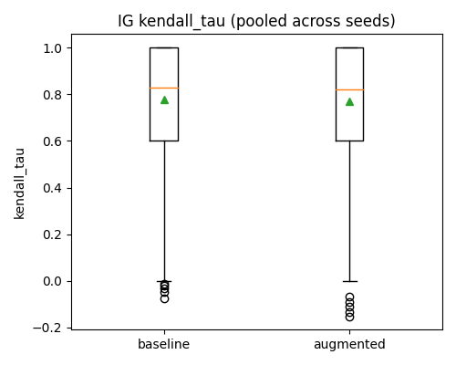
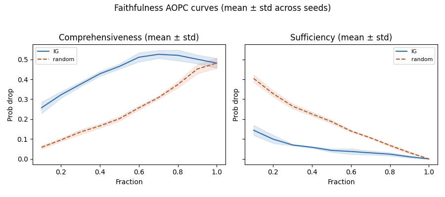
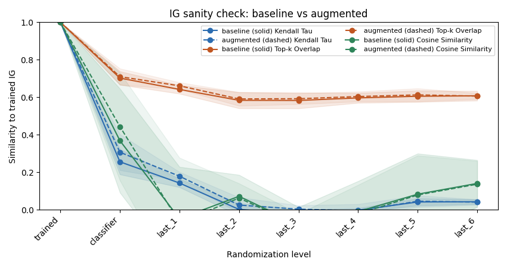
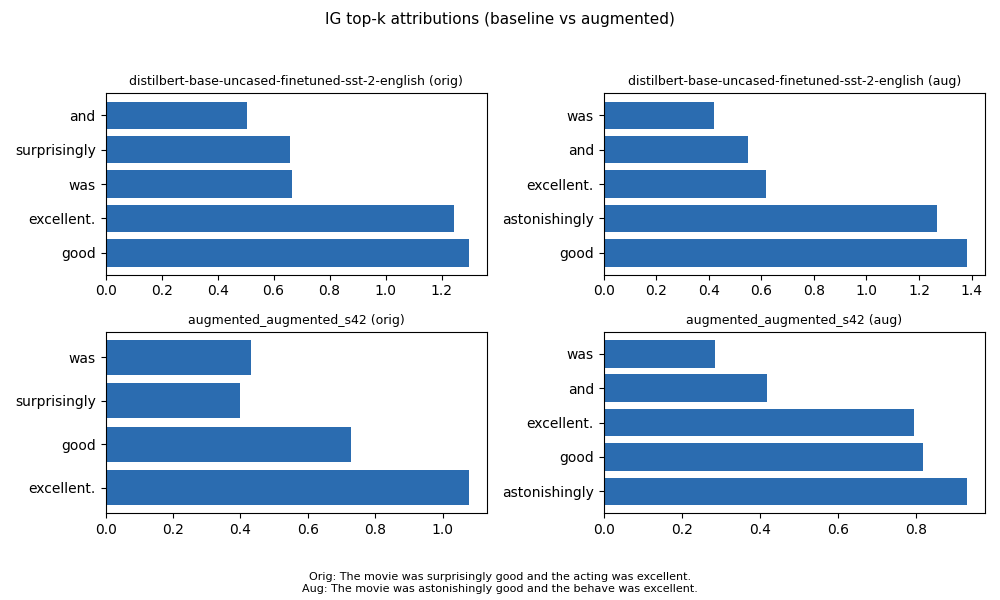

# Augmented-Explained-Transformer

<p align="center">
  
</p>


This project compares a baseline DistilBERT SST-2 model against an augmented model (WordNet
synonym replacement) and evaluates **explanation stability** using Integrated Gradients (IG),
LIME, and attention weights. We measure consistency (Kendall's tau, top-k overlap, cosine similarity),
faithfulness (AOPC), and sanity checks (layer randomization).

## What you get
- Baseline vs augmented explanation consistency with multi-seed aggregation
- Faithfulness curves (comprehensiveness/sufficiency)
- Sanity check curves (IG degradation under parameter randomization)
- Plots and summaries ready for the report
 
## Key Results
- **Consistency**: Augmented training improves explanation consistency (higher Kendall's tau and Top-k overlap) under synonym replacement.
- **Faithfulness**: Both models show high faithfulness (AOPC), significantly outperforming random baselines.
- **Sanity Checks**: IG explanations correctly degrade as model layers are randomized, confirming they reflect learned parameters.
- **Robustness**: The augmented model is more robust to adversarial attacks (TextFooler) while maintaining interpretable explanations.

### Consistency (IG Kendall's tau)
<p align="center">
  
</p>

### Faithfulness (Comprehensiveness)
<p align="center">
  
</p>

### Sanity Checks (Layer Randomization)
<p align="center">
  
</p>

### Example Explanation
<p align="center">
  
</p>


## Pipeline at a glance
1) Download SST-2 data
2) Create augmented CSVs
3) Train augmented model
4) Evaluate + explain
5) Consistency + attention + LIME
6) Faithfulness + sanity
7) Compare baseline vs augmented

## Project layout
- `configs/`: experiment configs
- `data/`: raw/interim/processed/external datasets
- `models/`: saved checkpoints
- `reports/`: figures and tables
- `paper/`: LaTeX report
- `src/aet/`: library code
- `scripts/`: entry-point scripts
- `tests/`: unit tests

## Requirements
- Python 3.10+
- `captum` (for Integrated Gradients)
- `transformers` & `torch`
- CUDA GPU (we used RTX 3060 Ti)
- Optional extras:
  - `textattack` for robustness/counterfactual stages
  - `lime` for LIME explanation

## Setup
Create and activate a virtual environment, then install dependencies:
```powershell
python -m venv .venv
.\.venv\Scripts\Activate.ps1
python -m pip install -U pip
python -m pip install -e ".[dev,attacks,lime]"
```

GPU install (CUDA 12.1 for my setup):
```powershell
python -m pip install --upgrade torch torchvision torchaudio --index-url https://download.pytorch.org/whl/cu121
```

## Data
Download SST-2 CSVs:
```powershell
python scripts/download_sst2.py
```

Inspect the dataset (optional):
```powershell
python scripts/inspect_sst2.py
```

Enable WordNet augmentation:
```powershell
python -m nltk.downloader wordnet
```

## Augmentation (for the augmented run)
Create augmented CSVs (WordNet):
```powershell
python scripts/augment_sst2.py --split train --combined --augment-fraction 0.1
python scripts/augment_sst2.py --split validation --augment-fraction 0.1
```

Back-translation (for future work):
```powershell
python scripts/augment_sst2.py --split train --combined --augment-fraction 0.1 --method backtranslation
```


Outputs are written to `data/interim/sst2_augmented/`.

## Configs
- `configs/baseline.yaml`: no fine-tuning (uses HF SST-2 model); `run_id: baseline`
- `configs/augmented.yaml`: fine-tune on augmented CSVs; `run_id: augmented`
- `configs/base.yaml`: template (CLI default)

Tip: set `project.run_id` to avoid overwriting reports across runs.


## Outputs (per run_id)
Most outputs are written under `reports/` with the `run_id` appended.

Examples:
- IG explanations: `reports/attributions/<run_id>/ig_samples.jsonl`
- Consistency: `reports/metrics/<run_id>/consistency_baseline.csv` + `*_summary.json`
- Attention: `reports/metrics/<run_id>/attention_consistency.csv` and `attention_ig_alignment.csv`
- LIME: `reports/metrics/<run_id>/lime_consistency.csv` + `*_summary.json`
- Faithfulness: `reports/metrics/<run_id>/faithfulness_aopc.jsonl` + `*_summary.json`
- Sanity: `reports/metrics/<run_id>/sanity_ig_randomization.csv` + `*_summary.json`
- Robustness: `reports/metrics/<run_id>/textfooler_results.csv` + `textfooler_summary.json`
- Counterfactuals: `reports/metrics/<run_id>/counterfactual_textfooler.jsonl` + `*_summary.json`
- Figures: `reports/figures/<run_id>/...`


## Multi-seed experiments (optional)
Multiseed command (baseline + augmented, aggregated):
```powershell
python scripts/run_full_multiseed.py --configs configs/baseline.yaml,configs/augmented.yaml --seeds 13,21,42,1337,2024 --stages consistency,attention,lime,faithfulness,sanity --aggregate --out-dir reports/metrics/multiseed
```

Generate compare plots:
```powershell
python scripts/report_explainability_multiseed.py --baseline-prefix baseline --augmented-prefix augmented --seeds 13,21,42,1337,2024 --metrics-dir reports/metrics --figures-dir reports/figures/compare --out reports/figures/compare/compare_summary_multiseed.json
python scripts/compare_sanity_randomization.py --baseline-multiseed reports/metrics/multiseed/baseline/multiseed_summary.json --augmented-multiseed reports/metrics/multiseed/augmented/multiseed_summary.json --out reports/figures/compare/sanity_ig_randomization_overlay.png
```
*(For single-seed manual runs, see [SINGLE_SEED_RUNS.md](SINGLE_SEED_RUNS.md))*

## Additional scripts (optional)
Single-example explanations:
```powershell
python scripts/ig_single_example.py --augment
python scripts/lime_single_example.py --augment
```

Interactive IG visualization (HTML):
```powershell
python scripts/visualize_ig.py --text "This movie is superb"
python scripts/visualize_ig.py --text "A noisy, hideous movie" --true-class 0
```

Augmentation + label-flip analysis:
```powershell
python scripts/analyze_augmentation.py --original-csv data/interim/sst2_augmented/train_original.csv --augmented-csv data/interim/sst2_augmented/train_augmented.csv
python scripts/analyze_augmentation.py --original-csv data/interim/sst2_augmented/train_original.csv --augmented-csv data/interim/sst2_augmented/train_augmented.csv --consistency-csv reports/metrics/baseline/consistency_baseline.csv
```

Open notebook:
```powershell
jupyter notebook notebooks/inspect_sst2.ipynb
```
